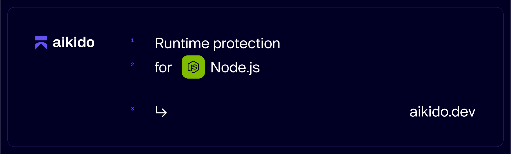

# Zen, in-app firewall for Node.js | by Aikido

[](https://www.npmjs.com/package/@aikidosec/firewall)
[](https://app.codecov.io/gh/aikidosec/firewall-node)
[](https://github.com/AikidoSec/firewall-node/blob/main/LICENSE)
[](http://makeapullrequest.com)
[](https://github.com/AikidoSec/firewall-node/actions/workflows/unit-test.yml)
[](https://github.com/AikidoSec/firewall-node/actions/workflows/end-to-end-tests.yml)

Zen, your in-app firewall for peace of mind– at runtime.

Zen by Aikido is an embedded Web Application Firewall that autonomously protects Node.js apps against common and critical attacks.

It protects your Node.js apps by scanning user input and where that data eventually flows to, allowing Zen to more accurately block SQL Injections, Path traversal attacks, and more. It runs on the same server as your Node.js app for simple [installation](#installation) and zero maintenance.

## Features

Zen will autonomously protect your Node.js applications against:

- 🛡️ [NoSQL injection attacks](https://www.aikido.dev/blog/web-application-security-vulnerabilities)
- 🛡️ [SQL injection attacks](https://www.aikido.dev/blog/the-state-of-sql-injections)
- 🛡️ [Command injection attacks](https://www.aikido.dev/blog/command-injection-in-2024-unpacked)
- 🛡️ [Prototype pollution](./docs/prototype-pollution.md)
- 🛡️ [Path traversal attacks](https://owasp.org/www-community/attacks/Path_Traversal)
- 🛡️ [Server-side request forgery (SSRF)](./docs/ssrf.md)
- 🛡️ [Attack wave detection](https://help.aikido.dev/zen-firewall/zen-features/attack-wave-protection)
- 🛡️ JS injection
- 🛡️ [IDOR attacks](./docs/idor-protection.md) (opt-in, see setup guide)

Zen operates autonomously on the same server as your Node.js app to:

- ✅ Secure your app like a classic web application firewall (WAF), but with none of the infrastructure or cost.
- ✅ Auto-generate API specifications
- ✅ Block known threat actors and bots.
- ✅ Geo-fencing to block or allow a selection of countries
- ✅ Rate limit specific API endpoints by IP or by user
- ✅ Allows you to block specific users manually

## Supported libraries and frameworks

Zen for Node.js 16+ is compatible with:

### Web frameworks

- ✅ [Express](docs/express.md) 4.x, 5.x
- ✅ [Hono](docs/hono.md) 4.x
- ✅ [hapi](docs/hapi.md) 21.x
- ✅ [micro](docs/micro.md) 10.x
- ✅ [Next.js](docs/next.md) 12.x, 13.x and 14.x
- ✅ [Fastify](docs/fastify.md) 4.x and 5.x
- ✅ [Koa](docs/koa.md) 3.x and 2.x
- ✅ [NestJS](docs/nestjs.md) 10.x and 11.x
- ✅ [Restify](docs/restify.md) 11.x, 10.x, 9.x and 8.x

### Database drivers

- ✅ [`mongodb`](https://www.npmjs.com/package/mongodb) 4.x, 5.x, 6.x and 7.x _(npm package versions, not MongoDB server versions)_
- ✅ [`mongoose`](https://www.npmjs.com/package/mongoose) 8.x, 7.x and 6.x
- ✅ [`pg`](https://www.npmjs.com/package/pg) 8.x and 7.x
- ✅ [`mysql`](https://www.npmjs.com/package/mysql) 2.x
- ✅ [`mysql2`](https://www.npmjs.com/package/mysql2) 3.x
- ✅ [`mariadb`](https://www.npmjs.com/package/mariadb) 3.x (3.5+ requires ESM instrumentation)
- ✅ [`sqlite3`](https://www.npmjs.com/package/sqlite3) 5.x
- ✅ [`node:sqlite`](https://nodejs.org/api/sqlite.html)
- ✅ [`better-sqlite3`](https://www.npmjs.com/package/better-sqlite3) 12.x, 11.x, 10.x, 9.x and 8.x
- ✅ [`postgres`](https://www.npmjs.com/package/postgres) 3.x
- ✅ [`@clickhouse/client`](https://www.npmjs.com/package/@clickhouse/client) 1.x
- ✅ [`@prisma/client`](https://www.npmjs.com/package/@prisma/client) 5.x

### Cloud providers

- ✅ [`@google-cloud/functions-framework`](https://www.npmjs.com/package/@google-cloud/functions-framework) 5.x, 4.x and 3.x
- ✅ [`@google-cloud/pubsub`](https://www.npmjs.com/package/@google-cloud/pubsub) 5.x, 4.x
- ✅ Google Cloud Functions
- ✅ AWS Lambda

### ORMs and query builders

See list above for supported database drivers.

- ✅ [`sequelize`](https://www.npmjs.com/package/sequelize)
- ✅ [`knex`](https://www.npmjs.com/package/knex)
- ✅ [`typeorm`](https://www.npmjs.com/package/typeorm)
- ✅ [`bookshelf`](https://www.npmjs.com/package/bookshelf)
- ✅ [`drizzle-orm`](https://www.npmjs.com/package/drizzle-orm)
- ✅ [`kysely`](https://www.npmjs.com/package/kysely)

### API tools

- ✅ [`graphql`](https://www.npmjs.com/package/graphql) 15.x, 16.x

### Data serialization tools

- ✅ [`xml2js`](https://www.npmjs.com/package/xml2js) 0.6.x, 0.5.x, ^0.4.18
- ✅ [`fast-xml-parser`](https://www.npmjs.com/package/fast-xml-parser) 5.x, 4.x
- ✅ [`xml-js`](https://www.npmjs.com/package/xml-js) 1.x

### Shell tools

- ✅ [`ShellJS`](https://www.npmjs.com/package/shelljs) 0.9.x, 0.8.x, 0.7.x

### Routers

- ✅ [`@koa/router`](https://www.npmjs.com/package/@koa/router) 14.x, 13.x, 12.x, 11.x and 10.x

### AI SDKs

Zen instruments the following AI SDKs to track which models are used and how many tokens are consumed, allowing you to monitor your AI usage and costs:

- ✅ [`openai`](https://www.npmjs.com/package/openai) 6.x, 5.x, 4.x
- ✅ [`@mistralai/mistralai`](https://www.npmjs.com/package/@mistralai/mistralai) 1.x
- ✅ [`@anthropic-ai/sdk`](https://www.npmjs.com/package/@anthropic-ai/sdk) ^0.40.x
- ✅ [`@aws-sdk/client-bedrock-runtime`](https://www.npmjs.com/package/@aws-sdk/client-bedrock-runtime) 3.x
- ✅ [`ai`](https://www.npmjs.com/package/ai) 6.x, 5.x, 4.x
- ✅ [`@google/genai`](https://www.npmjs.com/package/@google/genai) ^1.6.0

_Note: Prompt injection attacks are currently not covered by Zen._

## Installation

We recommend testing Zen locally or on staging before deploying to production.

```shell
# The --save-exact makes sure that you don't automatically install a newer version
$ npm install --save-exact @aikidosec/firewall

# The --exact makes sure that you don't automatically install a newer version
$ yarn add --exact @aikidosec/firewall
```

For framework- and provider- specific instructions, check out our docs:

- [Express](docs/express.md)
- [Fastify](docs/fastify.md)
- [Hapi](docs/hapi.md)
- [Koa](docs/koa.md)
- [Hono](docs/hono.md)
- [NestJS](docs/nestjs.md)
- [micro](docs/micro.md)
- [Next.js](docs/next.md)
- [Restify](docs/restify.md)
- [AWS Lambda](docs/lambda.md)
- [Google Cloud Functions](docs/cloud-functions.md)
- [Google Cloud Pub/Sub](docs/pubsub.md)

> [!NOTE]
> Many TypeScript projects use `import` syntax but still compile to CommonJS — in that case, the setup in the framework docs above works as-is. If your app runs as **native ESM** at runtime (e.g. `"type": "module"` in package.json), see [ESM setup](docs/esm.md) for additional steps.

## Guides

- [Troubleshooting](docs/troubleshooting.md) — common issues and how to debug Zen
- [ESM support](docs/esm.md) — setup for native ECMAScript module apps
- [Bundlers](docs/bundler.md) — using Zen with esbuild and other bundlers
- [Proxy / IP headers](docs/proxy.md) — configure client IP detection behind load balancers
- [Set the current user](docs/user.md) — identify users for rate limiting, blocking, and attack reports
- [IDOR protection](docs/idor-protection.md) — prevent data leaks in multi-tenant apps

## Reporting to your Aikido Security dashboard

> Aikido is your no nonsense application security platform. One central system that scans your source code & cloud, shows you what vulnerabilities matter, and how to fix them - fast. So you can get back to building.

Zen improves Aikido's offering by providing you with security in production. Use the automatic generation of API specifications together with our API scanning offering for even better API Security.

Only the necessary data gets reported back to Aikido, we scan your requests locally and only report back data once every 10 minutes.
If an attack on your application is detected, we report immediately allowing you to take swift action.

You can easily select which IP addresses and/or bots to block from curated lists inside our Dashboard.

You will need an Aikido account and a token to report events to Aikido. If you don't have an account, you can [sign up for free](https://app.aikido.dev/login). (No credit card required)

Here's how:

- [Log in to your Aikido account](https://app.aikido.dev/login).
- Go to [Zen](https://app.aikido.dev/runtime/services).
- Go to apps.
- Click on **Add app**.
- Choose a name for your app.
- Click **Generate token**.
- Copy the token.
- Set the token as an environment variable, `AIKIDO_TOKEN`, using [dotenv](https://github.com/motdotla/dotenv) or another method of your choosing.

## Running in production (blocking) mode

By default, Zen will only detect and report attacks to Aikido.

To block requests, set the `AIKIDO_BLOCK` environment variable to `true`.

See [Reporting to Aikido](#reporting-to-your-aikido-security-dashboard) to learn how to send events to Aikido.

## Additional configuration

[Configure Zen using environment variables for authentication, mode settings, debugging, and more.](https://help.aikido.dev/doc/configuration-via-env-vars/docrSItUkeR9)

## License

This program is offered under a commercial and under the AGPL license.
You can be released from the requirements of the AGPL license by purchasing
a commercial license. Buying such a license is mandatory as soon as you
develop commercial activities involving the Zen software without
disclosing the source code of your own applications.

For more information, please contact Aikido Security at this
address: support@aikido.dev or create an account at https://app.aikido.dev.

## Benchmarks

We run a benchmark on every commit to ensure Zen has a minimal impact on your application's performance.

See [benchmarks](benchmarks)

## Bug bounty program

Our bug bounty program is public and can be found by all registered Intigriti users at: https://app.intigriti.com/researcher/programs/aikido/aikidoruntime

## Contributing

See [CONTRIBUTING.md](.github/CONTRIBUTING.md) for more information.

## Code of Conduct

See [CODE_OF_CONDUCT.md](.github/CODE_OF_CONDUCT.md) for more information.

## Security

See [SECURITY.md](.github/SECURITY.md) for more information.
