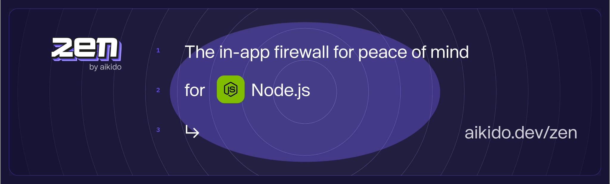

# Zen, in-app firewall for Node.js | by Aikido

[](https://www.npmjs.com/package/@aikidosec/firewall) 
[](https://app.codecov.io/gh/aikidosec/firewall-node) 
[](https://github.com/AikidoSec/firewall-node/blob/main/LICENSE) 
[](http://makeapullrequest.com) 
[](https://github.com/AikidoSec/firewall-node/actions/workflows/unit-test.yml) 
[](https://github.com/AikidoSec/firewall-node/actions/workflows/end-to-end-tests.yml) 

Zen, your in-app firewall for peace of mind– at runtime.

Zen by Aikido is an embedded Web Application Firewall that autonomously protects Node.js apps against common and critical attacks.

It protects your Node.js apps by preventing user input containing dangerous strings, which allow injection, pollution, and path traversal attacks. It runs on the same server as your Node.js app for simple [installation](#installation) and zero maintenance.

## Features

Zen will autonomously protect your Node.js applications against:

* 🛡️ [NoSQL injection attacks](https://www.aikido.dev/blog/web-application-security-vulnerabilities)
* 🛡️ [SQL injection attacks]([https://www.aikido.dev/blog/web-application-security-vulnerabilities](https://owasp.org/www-community/attacks/SQL_Injection))
* 🛡️ [Command injection attacks](https://owasp.org/www-community/attacks/Command_Injection)
* 🛡️ [Prototype pollution](./docs/prototype-pollution.md)
* 🛡️ [Path traversal attacks](https://owasp.org/www-community/attacks/Path_Traversal)
* 🛡️ [Server-side request forgery (SSRF)](./docs/ssrf.md)

Zen operates autonomously on the same server as your Node.js app to:

* ✅ Secure your app like a classic web application firewall (WAF), but with none of the infrastructure or cost.
* ✅ Rate limit specific API endpoints by IP or by user
* ✅ Allow you to block specific users manually

## Supported libraries and frameworks

Zen for Node.js 16+ is compatible with:

### Web frameworks

* ✅ [Express](docs/express.md) 4.x, 5.x
* ✅ [Hono](docs/hono.md) 4.x
* ✅ [hapi](docs/hapi.md) 21.x
* ✅ [micro](docs/micro.md) 10.x
* ✅ [Next.js](docs/next.md) 12.x, 13.x and 14.x
* ✅ Fastify (upcoming)

### Database drivers

* ✅ [`mongodb`](https://www.npmjs.com/package/mongodb) 4.x, 5.x and 6.x _(npm package versions, not MongoDB server versions)_
* ✅ [`mongoose`](https://www.npmjs.com/package/mongoose) 8.x, 7.x and 6.x
* ✅ [`pg`](https://www.npmjs.com/package/pg) 8.x and 7.x
* ✅ [`mysql`](https://www.npmjs.com/package/mysql) 2.x
* ✅ [`mysql2`](https://www.npmjs.com/package/mysql2) 3.x
* ✅ [`sqlite3`](https://www.npmjs.com/package/sqlite3) 5.x
* ✅ [`node:sqlite`](https://nodejs.org/api/sqlite.html)
* ✅ [`better-sqlite3`](https://www.npmjs.com/package/better-sqlite3) 11.x, 10.x, 9.x and 8.x
* ✅ [`postgres`](https://www.npmjs.com/package/postgres) 3.x

### Cloud providers

* ✅ [`@google-cloud/functions-framework`](https://www.npmjs.com/package/@google-cloud/functions-framework) 3.x
* ✅ [`@google-cloud/pubsub`](https://www.npmjs.com/package/@google-cloud/pubsub) 4.x
* ✅ Google Cloud Functions
* ✅ AWS Lambda

### ORMs and query builders

See list above for supported database drivers.

* ✅ [`sequelize`](https://www.npmjs.com/package/sequelize)
* ✅ [`knex`](https://www.npmjs.com/package/knex)
* ✅ [`typeorm`](https://www.npmjs.com/package/typeorm)
* ✅ [`bookshelf`](https://www.npmjs.com/package/bookshelf)
* ✅ [`drizzle-orm`](https://www.npmjs.com/package/drizzle-orm)

### API tools

* ✅ [`graphql`](https://www.npmjs.com/package/graphql) 16.x

### Data serialization tools

* ✅ [`xml2js`](https://www.npmjs.com/package/xml2js) 0.6.x, 0.5.x, ^0.4.18
* ✅ [`fast-xml-parser`](https://www.npmjs.com/package/fast-xml-parser) 4.x
* ✅ [`xml-js`](https://www.npmjs.com/package/xml-js) 1.x

### Shell tools

* ✅ [`ShellJS`](https://www.npmjs.com/package/shelljs) 0.8.x, 0.7.x

## Installation

We recommend testing Zen locally or on staging before deploying to production.

```shell
# The --save-exact makes sure that you don't automatically install a newer version
$ npm install --save-exact @aikidosec/firewall

# The --exact makes sure that you don't automatically install a newer version
$ yarn add --exact @aikidosec/firewall
```

For framework- and provider- specific instructions, check out our docs:

- [Express.js-based apps](docs/express.md)
- [AWS Lambda](docs/lambda.md)
- [Google Cloud Functions](docs/cloud-functions.md)
- [Google Cloud Pub/Sub](docs/pubsub.md)

## Reporting to your Aikido Security dashboard

> Aikido is your no nonsense application security platform. One central system that scans your source code & cloud, shows you what vulnerabilities matter, and how to fix them - fast. So you can get back to building.

Zen is a new product by Aikido. Built for developers to level up their security. While Aikido scans, get Zen for always-on protection.

You can use some of Zen’s features without Aikido, of course. Peace of mind is just a few lines of code away.

But you will get the most value by reporting your data to Aikido.

You will need an Aikido account and a token to report events to Aikido. If you don't have an account, you can [sign up for free](https://app.aikido.dev/login).

Here's how:
* [Log in to your Aikido account](https://app.aikido.dev/login).
* Go to [Zen](https://app.aikido.dev/runtime/services).
* Go to apps.
* Click on **Add app**.
* Choose a name for your app.
* Click **Generate token**.
* Copy the token.
* Set the token as an environment variable, `AIKIDO_TOKEN`, using [dotenv](https://github.com/motdotla/dotenv) or another method of your choosing.

## Running in production (blocking) mode

By default, Zen will only detect and report attacks to Aikido.

To block requests, set the `AIKIDO_BLOCK` environment variable to `true`.

See [Reporting to Aikido](#reporting-to-your-aikido-security-dashboard) to learn how to send events to Aikido.

## License

This program is offered under a commercial and under the AGPL license.
You can be released from the requirements of the AGPL license by purchasing
a commercial license. Buying such a license is mandatory as soon as you
develop commercial activities involving the Zen software without
disclosing the source code of your own applications. 

For more information, please contact Aikido Security at this
address: support@aikido.dev or create an account at https://app.aikido.dev.

## Performance

We run a benchmark on every commit to ensure Zen has a minimal impact on your application's performance.

The benchmark runs [a simple MongoDB query](benchmarks/nosql-injection/getUser.js) to measure the difference between two runs with and without Zen:

| Without Zen      | With Zen      | Difference in ms |
|------------------|---------------|------------------|
| 0.214ms          | 0.222ms       | +0.008ms         |

(Using Node.js 18.x and MongoDB 6.3.x. Results will vary depending on your hardware.)

See [benchmarks](benchmarks) for more information.

## Bug bounty program

Our bug bounty program is public and can be found by all registered Intigriti users at: https://app.intigriti.com/researcher/programs/aikido/aikidoruntime

## Contributing

See [CONTRIBUTING.md](.github/CONTRIBUTING.md) for more information.

## Code of Conduct

See [CODE_OF_CONDUCT.md](.github/CODE_OF_CONDUCT.md) for more information.

## Security

See [SECURITY.md](.github/SECURITY.md) for more information.
